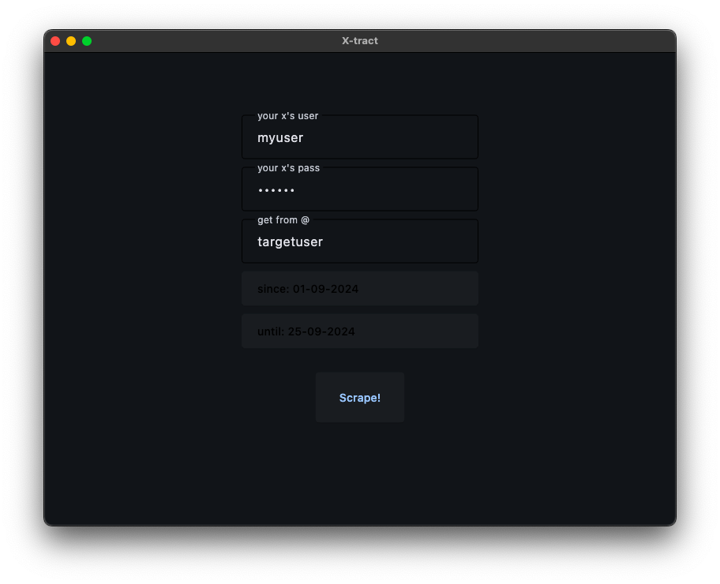
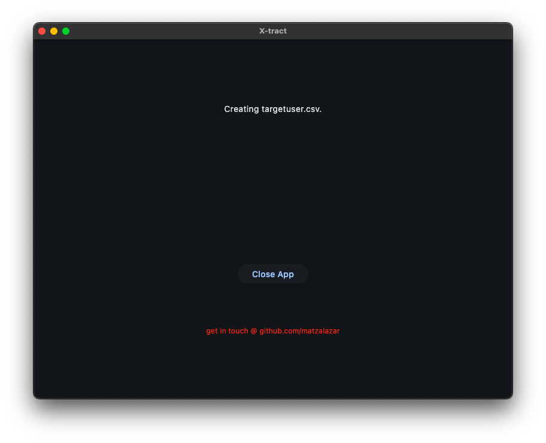

# xtract

This is a simple web scraping application that collects posts from X (formerly Twitter) using Selenium for browser automation and Flet for building the user interface. The app allows you to specify a user, a date range, and scrape the posts within that period.

**xtract** is designed to be a useful tool for **journalists** and **social scientists** who need to analyze social media data. Its user-friendly interface requires no programming knowledge, making it accessible to non-technical users.

This tool bypasses the limitations of the official X API, allowing for more flexible data collection. However, **it's recommended to use secondary accounts** when logging in, as there is a risk of your account being banned due to X's scraping detection mechanisms.

## Features

- Scrapes posts from a specific X user within a date range.
- Saves posts and links to a CSV file for easy analysis.
- Simple and intuitive UI built with Flet.
- Logs progress and errors in real-time.

## Prerequisites

Make sure you have the following installed:

- Python 3.7 or higher
- [Flet](https://flet.dev/docs/install/)
- [Selenium](https://selenium-python.readthedocs.io/installation.html)
- [webdriver-manager](https://pypi.org/project/webdriver-manager/)
- Google Chrome installed (the app automatically detects the version)

You can install the necessary Python packages using the `requirements.txt` file.

## How to Run

Clone the repository:
```bash
$ git clone https://github.com/matzalazar/xtract.git
```

Install the necessary dependencies:
```bash
$ pip install -r requirements.txt
```

Navigate to the project directory:
```bash
$ cd xtract
```

Run the application:
```bash
$ python main.py
```

## Usage

- Enter your X credentials (username and password) in the appropriate fields.
- Type the target username (e.g., @elonmusk) from which you want to scrape posts.
- Select a start ('since') and end ('until') date to limit the scraping period.
- Press the 'Scrape!' button, and the app will log the progress in real-time on the screen.





## Structure

```plaintext
.
├── automation
│   └── search.py       # Contains the scraping logic with Selenium
├── downloads           # Directory where the scraped data is stored
├── assets              # Folder for storing app assets (e.g., icons)
├── main.py             # Main app file with Flet interface
├── requirements.txt    # Required dependencies
└── README.md           # Project documentation
```

## Logging

During the scraping process, the app logs progress and any errors on the screen. The logs display the last 10 messages to keep track of what the app is doing.

## Contribution

Feel free to fork this repository, open issues, or submit pull requests. All contributions are welcome! 

## License

This project is licensed under the MIT License.
